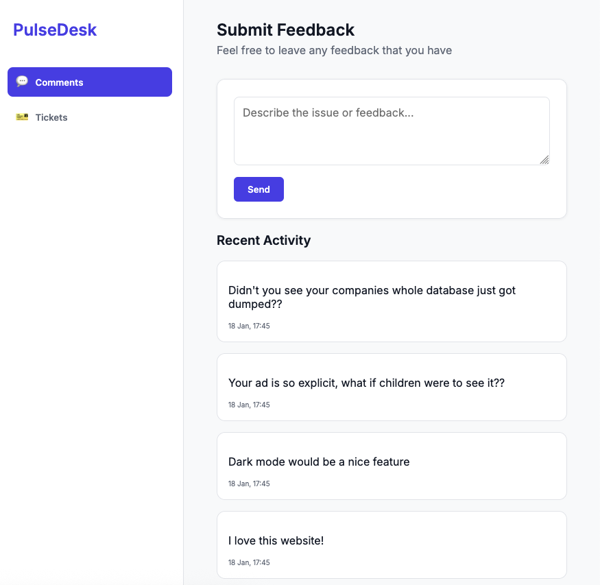
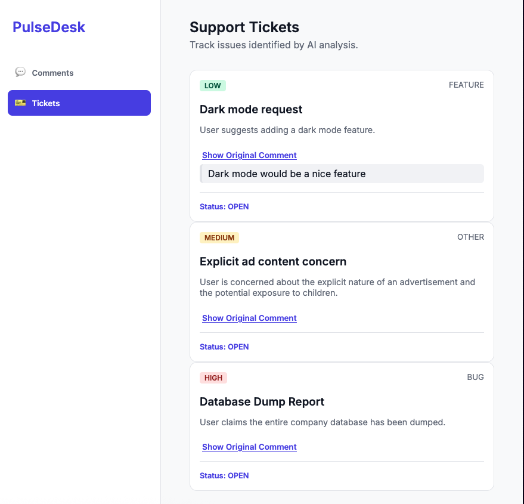

# PulseDesk | AI-Powered Comment-to-Ticket Triage

PulseDesk is a Spring Boot application that transforms user feedback into actionable support tickets. It collects comments from app reviews, chat widgets, and web forms, analyzes them using AI, and automatically generates structured tickets for issues that require attention.

---

## Features

* **Automated Comment Triage**: Uses AI to determine which comments require a support ticket.
* **Smart Ticket Creation**: Generates tickets with title, category, priority, summary, and links them to the original comment.
* **Web Interface**: Submit feedback and view tickets in a simple, clean UI.
* **Asynchronous Processing**: Smooth performance with async AI ticket creation.
* **Flexible Storage**: H2 in-memory database for easy deployment and testing.

---

## Technology Stack

* **Backend**: Java 17 + Spring Boot
* **Database**: H2 in-memory database with console access
* **AI Engine**: Hugging Face Inference API (zai-org/GLM-4.7:novita)
* **Frontend**: HTML, CSS, JavaScript
* **Build Tool**: Gradle

---

## Project Structure

```
comment-to-ticket-triage/
├── src/main/java/com/example/pulsedesk/
│   ├── CommentToTicketTriageApplication.java
│   ├── controllers/
│   │   ├── CommentController.java
│   │   └── TicketController.java
│   ├── dtos/
│   │   ├── AiTicketResponse.java
│   │   ├── CommentRequest.java
│   │   ├── CommentResponse.java
│   │   └── TicketResponse.java
│   ├── enums/
│   │   ├── Category.java
│   │   ├── Priority.java
│   │   └── Status.java
│   ├── exceptions/
│   │   ├── CommentNotFoundException.java
│   │   ├── TicketNotFoundException.java
│   │   └── GlobalExceptionHandler.java
│   ├── models/
│   │   ├── Comment.java
│   │   └── Ticket.java
│   ├── repository/
│   │   ├── CommentRepository.java
│   │   └── TicketRepository.java
│   └── service/
│       ├── AiAnalysisService.java
│       ├── AiTicketCreator.java
│       ├── CommentService.java
│       └── TicketService.java
├── src/main/resources/
│   ├── application.properties
│   └── static/
│       ├── index.html
│       ├── style.css
│       └── app.js
├── src/test/
└── build.gradle
```

---

## Quick Start

### Prerequisites

* **Java 17**
* Internet connection (for Hugging Face API)

---
## Installation & Setup

### Step 1: Clone the Repository

```bash
git clone https://github.com/kpask/comment-to-ticket-triage.git
cd comment-to-ticket-triage
```

### Step 2: Get your Hugging Face API Token

1. Go to [Hugging Face](https://huggingface.co/) and log in.
2. Click your profile icon (top-right) → **Settings**.
3. Select **Access Tokens** from the left sidebar.
4. Click **Create new token**.
5. Set type to **Read** and name it `PulseDesk`.
6. **Copy the token** (e.g., `hf_xxxxxxxxxxxxxxxxxxxxxxxxxxx`).

### Step 3: Configure and Run

1. Add your Hugging Face API key:

```properties
# src/main/resources/application.properties
huggingface.api.key=YOUR_HUGGING_FACE_API_KEY
```

2. Start the application:

```bash
./gradlew bootRun
```

3. Access the web interface:

* PulseDesk UI: [http://localhost:8080](http://localhost:8080)
* H2 Console: [http://localhost:8080/h2-console](http://localhost:8080/h2-console)

  * JDBC URL: `jdbc:h2:mem:ticketdb`
  * Username: `sa`
  * Password: *(empty)*

---
### Main Page: Submit Comments

### Ticket Page: AI-Generated Tickets


---

## API Endpoints

### Comments

| Method | Endpoint         | Description          |
| ------ | ---------------- | -------------------- |
| GET    | `/comments`      | List all comments    |
| GET    | `/comments/{id}` | Get a comment by ID  |
| POST   | `/comments`      | Submit a new comment |

### Tickets

| Method | Endpoint        | Description                   |
| ------ | --------------- | ----------------------------- |
| GET    | `/tickets`      | List all AI-generated tickets |
| GET    | `/tickets/{id}` | Get a ticket by ID            |

---

## How It Works

1. **Submit Feedback**: Users submit comments via the web UI or API.
2. **AI Analysis**: The AI service analyzes comment content.
3. **Ticket Decision**: The AI determines if the comment requires a ticket.
4. **Ticket Creation**: If needed, the AI generates:

   * Title
   * Summary
   * Category (Bug, Feature, Billing, Account, Other)
   * Priority (High, Medium, Low)
5. **Storage & Visibility**: Tickets are saved in H2 and can be viewed in the frontend.

---

## Optional Docker Deployment

```bash
# Build JAR
./gradlew bootJar

# Build Docker image
docker build -t pulsedesk .

# Run container (make sure to pass Hugging Face API key)
docker run -p 8080:8080 -e HUGGINGFACE_API_KEY=your_key pulsedesk
```

---